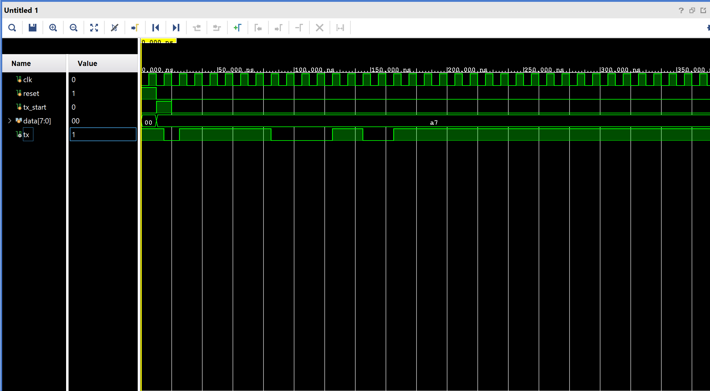

# UART Transmitter in Verilog HDL

> A modular UART (Universal Asynchronous Receiver/Transmitter) Transmitter implemented in Verilog HDL using an FSM-based architecture. The design is fully synthesizable and verified through simulation, making it suitable for FPGA implementation and digital design learning.

---

## 📖 Overview

This project implements an 8-bit UART transmitter in Verilog HDL. The transmitter converts parallel data into a serial UART frame consisting of a start bit, eight data bits (LSB first), and a stop bit.

The design follows a modular architecture where each hardware block performs a dedicated function, making the project easy to understand, verify, and extend.

---

## 🧪 Simulation Result

The UART transmitter was verified using a Verilog testbench in Vivado Simulator.

### UART Transmission Waveform



The waveform confirms:

- Correct Start Bit generation
- LSB-first data transmission
- Correct baud timing
- Proper Stop Bit generation

## ✨ Features

- Modular RTL Design
- FSM-Based Controller
- Configurable Baud Rate Generator
- 8-bit UART Transmission
- LSB-First Data Transmission
- Start and Stop Bit Generation
- Synthesizable Verilog HDL
- Comprehensive Testbench


## 📂 Project Structure

```
uart-transmitter-verilog/
│
├── rtl/
│   ├── baud_rate.v
│   ├── uart_fsm.v
│   ├── shift_register.v
│   ├── bit_counter.v
│   └── uart_tx_top.v
│
├── tb/
│   └── uart_tx_tb.v
│
├── docs/
│
├── waveforms/
│
├── README.md
└── LICENSE
```

---


---

## 📡 UART Frame Format

```
--------------------------------------------------------
| Start | D0 | D1 | D2 | D3 | D4 | D5 | D6 | D7 | Stop |
--------------------------------------------------------
    0      LSB -----------------------------> MSB    1
```

- 1 Start Bit
- 8 Data Bits (LSB First)
- 1 Stop Bit
- No Parity

---

## 🧪 Simulation

The design has been verified using a Verilog testbench.

Simulation demonstrates:

- Correct Start Bit Generation
- Correct LSB-First Transmission
- Accurate Baud Timing
- Proper Stop Bit Generation

Waveform screenshots will be added in the `waveforms/` directory.

---

## 🛠️ Tools Used

- Verilog HDL
- Vivado 2024.2
- Vivado Simulator

---

## 🚀 Future Improvements

- UART Receiver
- Full UART Transceiver
- Configurable Data Width
- Parity Bit Support
- Multiple Stop Bits
- FPGA Demonstration
- Loopback Verification

---

## 📄 License

This project is licensed under the MIT License.

---

## 👨‍💻 Author

**Harinandanan S**

B.Tech Electronics and Communication Engineering  
College of Engineering Trivandrum (CET)

---

⭐ If you found this project useful, consider giving it a star!
